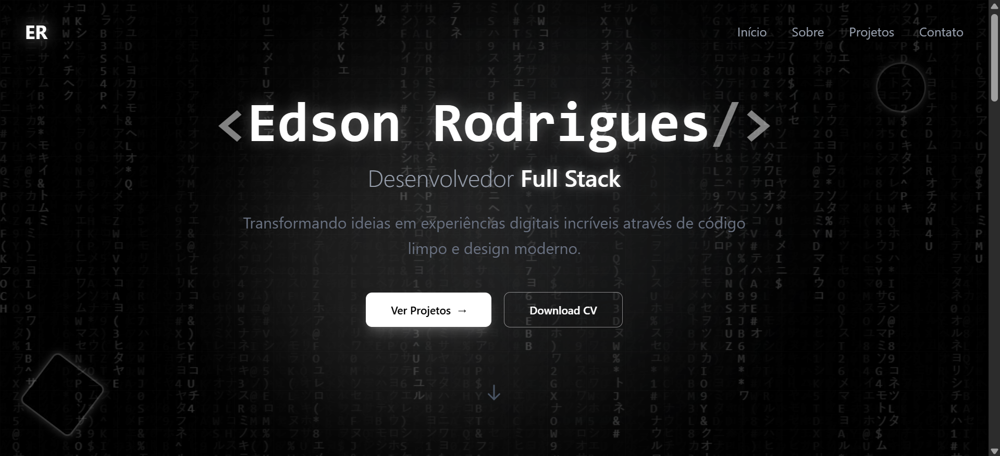

# 🚀 Portfolio Moderno - Edson Rodrigues

Bem-vindo ao repositório do meu portfolio pessoal! Este é um projeto desenvolvido com o objetivo de apresentar meus trabalhos, habilidades e experiências como **Desenvolvedor Full Stack**, utilizando as tecnologias mais modernas e performáticas do ecossistema Web.



## ✨ Destaques

O projeto foca em uma experiência de usuário (UX) fluida, com design minimalista em tons de preto e branco, animações dinâmicas e um sistema de gerenciamento de conteúdo (CMS) próprio.

- **Matrix Rain Effect:** Fundo temático interativo inspirado no filme Matrix.
- **GSAP Animations:** Transições suaves e efeitos de scroll modernos.
- **Painel Administrativo:** Interface privada para gerenciamento em tempo real de projetos e mensagens.
- **Supabase Integration:** Backend as a Service para autenticação, banco de dados e armazenamento de imagens.
- **Design Responsivo:** Otimizado para todos os tamanhos de tela.

## 🛠️ Tecnologias Utilizadas

### Frontend
- **React 19:** Framework principal para construção da interface.
- **Vite:** Build tool extremamente rápida.
- **TypeScript:** Tipagem estática para maior segurança e produtividade.
- **Tailwind CSS 4:** Estilização moderna e eficiente.
- **GSAP (GreenSock):** Motor de animações de alta performance.
- **React Router 7:** Gerenciamento de rotas e navegação.
- **React Icons:** Biblioteca de ícones versátil.

### Backend & Ferramentas
- **Supabase:** Banco de dados PostgreSQL, Autenticação e Storage.
- **ESLint:** Padronização e qualidade de código.

## 📁 Estrutura do Projeto

```text
src/
├── assets/          # Imagens e arquivos estáticos
├── components/      # Componentes reutilizáveis (UI, Seções, Admin)
├── context/         # Contextos globais do React
├── lib/             # Configurações de bibliotecas externas (Supabase)
├── pages/           # Páginas principais e rotas do sistema
│   └── admin/       # Páginas restritas do painel de controle
└── App.tsx          # Configuração de rotas e layout base
```

## 🚀 Como Executar o Projeto Localmente

Siga os passos abaixo para rodar o projeto em sua máquina de desenvolvimento:

1. **Clone o repositório:**
   ```bash
   git clone https://github.com/seu-usuario/my-portfolio.git
   cd my-portfolio
   ```

2. **Instale as dependências:**
   ```bash
   npm install
   ```

3. **Configure as variáveis de ambiente:**
   Crie um arquivo `.env` na raiz do projeto com suas credenciais do Supabase:
   ```env
   VITE_SUPABASE_URL=sua_url_do_supabase
   VITE_SUPABASE_ANON_KEY=sua_chave_anonima
   ```

4. **Inicie o servidor de desenvolvimento:**
   ```bash
   npm run dev
   ```
   O projeto estará disponível em `http://localhost:5173`.

## 🎨 Design System

O projeto utiliza uma paleta de cores monocromática para transmitir sofisticação e foco no conteúdo:
- **Fundo:** `#000000` (Pitch Black)
- **Texto Primário:** `#FFFFFF` (Pure White)
- **Destaques:** Tons de cinza e verde esmeralda sutil para elementos interativos.

---

Desenvolvido com ❤️ por [Edson Rodrigues](https://github.com/seu-usuario).
